# Hospital Dashboard Analysis

**Date**: 2026-02-07
**Analyst**: Code Analyst Teammate
**Scope**: Pet_to_You/pet-to-you-web/apps/hospital-dashboard/

---

## Executive Summary

The hospital-dashboard application is a **solid MVP foundation** with excellent UI/UX patterns using modern React 19, Next.js 16, and Framer Motion animations. However, it **relies entirely on mock data** and lacks integration with the robust backend API that exists. The codebase is clean and maintainable but needs significant work to become production-ready.

**Priority Status**: 🟡 **Medium Priority** - Core infrastructure exists, needs API integration and authentication

---

## 1. Current Implementation Review

### 1.1 Pages Implemented

| Page | Path | Status | Features |
|------|------|--------|----------|
| **Dashboard (Home)** | `/` | ✅ Implemented | Stats cards, revenue charts, booking table |
| **Bookings** | `/bookings` | ✅ Implemented | Full booking list with status badges, search/filter UI |
| **Patients** | `/patients` | ✅ Implemented | Patient list with pet information, search UI |
| **Reviews** | `/reviews` | ✅ Implemented | Review display, ratings, reply functionality UI |
| **Schedule** | `/schedule` | ❌ Missing | Route defined but no page file |
| **Revenue** | `/revenue` | ❌ Missing | Route defined but no page file |
| **Settings** | `/settings` | ❌ Missing | Route defined but no page file |

**Completion**: 4/7 pages (57%)

### 1.2 Component Quality Analysis

#### ✅ Strengths

**A. Navigation & Layout** (`Sidebar.tsx`, `Header.tsx`, `layout.tsx`)
- **Excellent**: Fixed sidebar with route-aware active states
- **Excellent**: Smooth Framer Motion animations (`whileHover`, `layoutId`)
- **Good**: Responsive design considerations (`pl-64` for sidebar offset)
- **Minor Issue**: Hard-coded hospital name ("서울동물병원") - needs dynamic data

**B. Stats Cards** (`StatsCard.tsx`)
- **Excellent**: Staggered animation entrance (`delay: index * 0.1`)
- **Excellent**: Visual hierarchy with gradient backgrounds
- **Good**: Percentage change indicators with color coding
- **Reusable**: Props-based design for any metric type

**C. Tables** (`DataTable`, `BookingTable`)
- **Good**: Consistent table structure using `@pet-to-you/ui` components
- **Good**: Status badges with semantic colors
- **Good**: Animate prop for row entrance animations
- **Missing**: Pagination, sorting, filtering logic (UI only)

**D. Charts** (`RevenueChart.tsx`)
- **Good**: Recharts integration with custom styling
- **Good**: Responsive container with proper aspect ratio
- **Good**: Custom tooltip with KRW formatting
- **Issue**: Duplicate chart on dashboard (line 52-53 in page.tsx)

#### ⚠️ Weaknesses

**A. Mock Data Dependency** (`mock-data.ts`)
- **Critical**: All pages use mock data directly
- **Issue**: No API service layer exists
- **Issue**: No error handling or loading states
- **Issue**: Data refresh requires page reload

**B. No State Management**
- **Missing**: Zustand store exists in dependencies but unused
- **Missing**: React Query for data fetching and caching
- **Issue**: Direct data imports in components

**C. Incomplete Features**
- **Missing**: Search functionality (UI exists, no logic)
- **Missing**: Filter functionality (button exists, no logic)
- **Missing**: Pagination (no implementation)
- **Missing**: Sorting (no implementation)
- **Missing**: Action buttons (상세보기, 답변하기) have no handlers

**D. Type Safety Issues**
- **Good**: TypeScript types defined in `types.ts`
- **Issue**: No validation or parsing of API responses
- **Issue**: No error boundary implementations
- **Missing**: Zod or similar runtime validation

### 1.3 Data Flow Architecture

```
Current: Component → Mock Data (direct import)
         ❌ No API layer
         ❌ No state management
         ❌ No caching
         ❌ No error handling

Target:  Component → React Query → API Service → Backend
         ✅ Automatic caching
         ✅ Optimistic updates
         ✅ Loading states
         ✅ Error recovery
```

### 1.4 Routing Structure

```
/app/
├── layout.tsx                 # Root layout
└── (dashboard)/
    ├── layout.tsx            # Dashboard shell (Sidebar + Header)
    ├── page.tsx              # ✅ Home dashboard
    ├── bookings/
    │   └── page.tsx          # ✅ Booking management
    ├── patients/
    │   └── page.tsx          # ✅ Patient list
    ├── reviews/
    │   └── page.tsx          # ✅ Review management
    ├── schedule/             # ❌ MISSING PAGE
    ├── revenue/              # ❌ MISSING PAGE
    └── settings/             # ❌ MISSING PAGE
```

**Issue**: Sidebar links to non-existent pages → 404 errors

---

## 2. Critical Issues Identified

### 2.1 Security & Authentication

| Issue | Severity | Impact |
|-------|----------|--------|
| No authentication system | 🔴 **Critical** | Anyone can access dashboard without login |
| No authorization checks | 🔴 **Critical** | No role-based access control (RBAC) |
| No session management | 🔴 **Critical** | No JWT handling or token refresh |
| Hard-coded hospital data | 🟠 **High** | Cannot support multi-hospital system |
| No CSRF protection | 🟠 **High** | Vulnerable to cross-site attacks |

**Required**: NextAuth.js integration with JWT strategy

### 2.2 Performance Bottlenecks

| Issue | Impact | Fix |
|-------|--------|-----|
| No data fetching optimization | Unnecessary re-renders | Add React Query |
| No code splitting | Large initial bundle | Add dynamic imports |
| Duplicate chart renders | Wasted DOM operations | Remove duplicate (line 52) |
| No image optimization | Slow page loads | Add Next.js Image component |
| All animations run on mount | Layout shift | Add AnimatePresence |

**Estimated Bundle Size**: ~500KB (before optimization)
**Target**: <200KB initial, <2MB total

### 2.3 UX Pain Points

| Issue | User Impact | Priority |
|-------|-------------|----------|
| No loading states | Users see empty data briefly | 🟠 High |
| No error messages | Failed operations are silent | 🔴 Critical |
| No success feedback | User unsure if action succeeded | 🟠 High |
| Search doesn't work | Cannot find specific records | 🟠 High |
| Missing pages | Clicking nav items → 404 | 🔴 Critical |
| No offline support | Breaks without internet | 🟡 Medium |

### 2.4 Code Quality Concerns

| Category | Issue | Recommendation |
|----------|-------|----------------|
| **Error Handling** | Zero error boundaries | Add error boundaries to layouts |
| **Loading States** | No suspense boundaries | Add React Suspense |
| **Accessibility** | No ARIA labels on interactive elements | Add semantic HTML + ARIA |
| **SEO** | No metadata | Add Next.js metadata API |
| **Testing** | No tests exist | Add Vitest + Testing Library |
| **Documentation** | No JSDoc comments | Add component documentation |

---

## 3. API Integration Points

### 3.1 Available Backend Endpoints

Backend API is **production-ready** with comprehensive endpoints:

#### **Hospital Dashboard Controller** (`/hospitals/:hospitalId/dashboard`)

| Method | Endpoint | Purpose | Frontend Page |
|--------|----------|---------|---------------|
| GET | `/bookings` | Get completed bookings | Dashboard, Bookings |
| GET | `/statistics` | Get dashboard stats | Dashboard (Stats Cards) |
| GET | `/medical-records` | List medical records | New: Medical Records page |
| POST | `/medical-records` | Create record | Bookings → Record creation |
| PUT | `/medical-records/:id` | Update record | Record editing |
| GET | `/claims` | List insurance claims | New: Claims page |
| GET | `/payments` | List settlements | Revenue page |
| POST | `/documents/upload` | Upload medical docs | Record form |

#### **BFF Hospital Controller** (`/bff/hospital`)

| Method | Endpoint | Purpose | Benefits |
|--------|----------|---------|----------|
| GET | `/dashboard` | **Aggregated dashboard data** | Single API call for entire dashboard |
| GET | `/revenue` | Revenue analytics | Revenue page |
| GET | `/patients/analytics` | Patient insights | Patients page |
| GET | `/inventory` | Inventory status | Settings/Inventory page |
| GET | `/staff/performance` | Staff metrics | Settings/Staff page |

**Recommendation**: Use BFF endpoints for dashboard pages (optimized, cached, aggregated)

### 3.2 Required API Service Layer

Create `src/lib/api/` structure:

```typescript
// src/lib/api/client.ts
import axios from 'axios'

export const apiClient = axios.create({
  baseURL: process.env.NEXT_PUBLIC_API_URL,
  headers: { 'Content-Type': 'application/json' }
})

// Interceptors: JWT token injection, error handling, retry logic

// src/lib/api/dashboard.ts
export const dashboardApi = {
  getStatistics: (hospitalId: string) =>
    apiClient.get(`/hospitals/${hospitalId}/dashboard/statistics`),

  getBookings: (hospitalId: string, params?: BookingFilters) =>
    apiClient.get(`/hospitals/${hospitalId}/dashboard/bookings`, { params }),

  // BFF endpoint for optimized dashboard load
  getDashboardData: (hospitalId: string) =>
    apiClient.get('/bff/hospital/dashboard')
}

// src/lib/api/bookings.ts
export const bookingsApi = {
  list: (hospitalId: string) => ...,
  complete: (hospitalId: string, bookingId: string) => ...,
  update: (hospitalId: string, bookingId: string, data: any) => ...
}

// src/lib/api/patients.ts
export const patientsApi = { ... }

// src/lib/api/reviews.ts
export const reviewsApi = { ... }
```

### 3.3 Data Transformation Needs

Backend returns different structure than current mock data:

**Example: Statistics Endpoint**

```typescript
// Backend Response (from /bff/hospital/dashboard)
{
  todaysBookings: { total: 48, completed: 12, inProgress: 5, ... },
  revenue: { today: { total: 12450000 }, week: { total: ... } },
  recentReviews: { averageRating: 4.8, totalReviews: 128, ... },
  performance: { utilizationRate: 0.85, avgWaitTime: 15, ... }
}

// Current Mock Data Structure
{
  totalRevenue: 12450000,
  revenueChange: 12.5,
  totalBookings: 48,
  bookingsChange: 8.2,
  ...
}
```

**Transformation Layer Needed**:

```typescript
// src/lib/transformers/dashboard.ts
export function transformDashboardData(apiData: BFFDashboardResponse): Stats {
  return {
    totalRevenue: apiData.revenue.today.total,
    revenueChange: calculateChange(apiData.revenue.today, apiData.revenue.yesterday),
    totalBookings: apiData.todaysBookings.total,
    bookingsChange: calculateChange(/* ... */),
    totalPatients: apiData.patients?.total || 0,
    averageRating: apiData.recentReviews.averageRating
  }
}
```

### 3.4 React Query Integration

Replace direct mock imports with React Query:

```typescript
// src/hooks/useDashboardData.ts
import { useQuery } from '@tanstack/react-query'
import { dashboardApi } from '@/lib/api/dashboard'

export function useDashboardData(hospitalId: string) {
  return useQuery({
    queryKey: ['dashboard', hospitalId],
    queryFn: () => dashboardApi.getDashboardData(hospitalId),
    staleTime: 3 * 60 * 1000, // 3 minutes (matches BFF cache)
    refetchInterval: 5 * 60 * 1000, // Auto-refresh every 5 min
  })
}

// Usage in page.tsx
export default function DashboardPage() {
  const { data, isLoading, error } = useDashboardData(hospitalId)

  if (isLoading) return <DashboardSkeleton />
  if (error) return <ErrorState error={error} />

  return <div>...</div>
}
```

---

## 4. Reusable Components Analysis

### 4.1 Components Ready for `@pet-to-you/ui`

**High Priority** (Generic, reusable):

| Component | Complexity | Dependencies | Benefits |
|-----------|------------|--------------|----------|
| `StatsCard.tsx` | Low | Framer Motion, Lucide | Metrics display across all dashboards |
| `BookingTable.tsx` | Medium | DataTable, Badge | Generic booking display |
| `RevenueChart.tsx` | Medium | Recharts | Financial charts everywhere |
| Sidebar navigation logic | High | None | Multi-app navigation pattern |
| Header search bar | Low | Input component | Universal search UX |

**Components Already in UI Package**:
- ✅ `Card` (used extensively)
- ✅ `Badge` (used for status indicators)
- ✅ `Button` (used in CTAs)
- ✅ `DataTable` (used for lists)
- ✅ `Input` (used in forms)

**Missing Core Components**:

```typescript
// Needed in @pet-to-you/ui:
- Select (dropdown filters)
- Dialog/Modal (for forms, confirmations)
- Toast (success/error notifications)
- Skeleton (loading states)
- Pagination
- DatePicker (for date filters)
- Tabs (for multi-section views)
- Avatar (for user profiles)
- Empty State (for no data scenarios)
```

### 4.2 shadcn/ui Integration Strategy

**Recommended shadcn Components**:

```bash
# Essential components to add:
npx shadcn-ui@latest add select
npx shadcn-ui@latest add dialog
npx shadcn-ui@latest add toast
npx shadcn-ui@latest add skeleton
npx shadcn-ui@latest add calendar
npx shadcn-ui@latest add tabs
npx shadcn-ui@latest add avatar
npx shadcn-ui@latest add dropdown-menu
```

**Integration Process**:
1. Add components to `/packages/ui/src/`
2. Export from `/packages/ui/src/index.ts`
3. Re-style with Toss-inspired design tokens
4. Document usage in Storybook (future)

### 4.3 Component Extraction Recommendations

**1. Extract `StatsCard` to UI Package**

```typescript
// Before (hospital-dashboard specific)
import { StatsCard } from "@/components/dashboard/StatsCard"

// After (shared across all apps)
import { MetricCard } from "@pet-to-you/ui"
```

**Benefits**: Reusable in business-dashboard, admin-dashboard

**2. Create `StatusBadge` Utility**

Currently duplicated in `BookingTable.tsx` and `bookings/page.tsx`:

```typescript
// @pet-to-you/ui/StatusBadge.tsx
export function getStatusBadge(status: BookingStatus) {
  const config: Record<BookingStatus, { variant: BadgeVariant; label: string }> = {
    pending: { variant: 'warning', label: '대기중' },
    confirmed: { variant: 'default', label: '확정' },
    completed: { variant: 'success', label: '완료' },
    cancelled: { variant: 'error', label: '취소' },
  }
  const { variant, label } = config[status]
  return <Badge variant={variant}>{label}</Badge>
}
```

**3. Create Generic `DataTable` Wrapper**

Add sorting, pagination, filtering to the base `DataTable`:

```typescript
// @pet-to-you/ui/EnhancedDataTable.tsx
interface EnhancedDataTableProps<T> {
  data: T[]
  columns: ColumnDef<T>[]
  searchable?: boolean
  sortable?: boolean
  pagination?: PaginationConfig
  onRowClick?: (row: T) => void
}
```

---

## 5. Priority Recommendations

### 5.1 High Priority (P0) - Security & Core Functionality

**🔴 Critical** (Complete before any production use)

| Task | Effort | Dependencies | Blocker For |
|------|--------|--------------|-------------|
| **1. NextAuth.js Integration** | 2 days | none | All features |
| - Configure JWT strategy | 4h | - | - |
| - Add session provider | 2h | JWT | - |
| - Create protected routes | 3h | Session | - |
| - Hospital ID resolution | 3h | Session | API calls |
| **2. API Service Layer** | 2 days | Auth | All data fetching |
| - Create API client with interceptors | 4h | - | - |
| - Implement dashboard API service | 4h | Client | Dashboard |
| - Implement bookings API service | 4h | Client | Bookings page |
| - Add error handling | 2h | Services | UX |
| **3. React Query Setup** | 1 day | API services | Performance |
| - Configure QueryClient | 2h | - | - |
| - Create dashboard hooks | 4h | API | Dashboard |
| - Add loading/error states | 2h | Hooks | UX |
| **4. Complete Missing Pages** | 2 days | API services | Navigation |
| - Schedule page | 4h | Bookings API | Sidebar |
| - Revenue analytics page | 6h | Payments API | Sidebar |
| - Settings page | 6h | Hospital API | Sidebar |

**Total P0 Effort**: ~7 days (1 developer)

### 5.2 High Priority (P1) - UX & Polish

**🟠 Important** (Complete within 2 weeks)

| Task | Effort | Impact |
|------|--------|--------|
| **5. Add Loading States** | 1 day | User experience |
| - Skeleton loaders | 4h | Visual feedback |
| - Suspense boundaries | 2h | React best practices |
| - Progress indicators | 2h | User confidence |
| **6. Implement Search/Filter** | 2 days | Usability |
| - Booking search | 4h | Core feature |
| - Patient search | 4h | Core feature |
| - Date range filters | 4h | Analytics |
| - Status filters | 4h | Management |
| **7. Error Handling** | 1 day | Reliability |
| - Error boundaries | 3h | Crash prevention |
| - Toast notifications | 3h | User feedback |
| - Retry logic | 2h | Resilience |
| **8. Accessibility** | 1 day | Compliance |
| - ARIA labels | 4h | Screen readers |
| - Keyboard navigation | 3h | Power users |
| - Focus management | 1h | UX |

**Total P1 Effort**: ~5 days

### 5.3 Medium Priority (P2) - Enhancements

**🟡 Nice to Have** (Complete within 1 month)

| Task | Effort | Benefits |
|------|--------|----------|
| **9. Performance Optimization** | 2 days | Speed, UX |
| - Code splitting | 4h | -40% bundle |
| - Image optimization | 2h | Faster loads |
| - Memoization | 3h | Less re-renders |
| - Lazy loading | 3h | Better TTI |
| **10. Testing** | 3 days | Quality |
| - Unit tests (Vitest) | 8h | Confidence |
| - Integration tests | 8h | Coverage |
| - E2E tests (Playwright) | 8h | Regression |
| **11. UI Library Expansion** | 2 days | Consistency |
| - Extract StatsCard | 2h | Reusability |
| - Add shadcn components | 4h | Features |
| - Create StatusBadge utility | 2h | DRY |
| - Enhanced DataTable | 6h | Power features |

**Total P2 Effort**: ~7 days

### 5.4 Low Priority (P3) - Future Features

- Real-time updates (WebSockets)
- Offline support (Service Worker)
- Advanced analytics dashboards
- Report generation (PDF exports)
- Multi-language support (i18n)

---

## 6. Implementation Roadmap

### Phase 1: Security Foundation (Week 1)

```mermaid
graph LR
    A[NextAuth.js Setup] --> B[Protected Routes]
    B --> C[Hospital ID Resolution]
    C --> D[API Client Setup]
    D --> E[Phase 1 Complete ✅]
```



**Deliverables**:
- ✅ Users must login to access dashboard
- ✅ JWT tokens automatically attached to API calls
- ✅ Hospital ID available in all components
- ✅ Secure API communication established

### Phase 2: Data Integration (Week 2)

```mermaid
graph LR
    A[React Query Setup] --> B[Dashboard API Integration]
    B --> C[Bookings API Integration]
    C --> D[Patients API Integration]
    D --> E[Phase 2 Complete ✅]
```



**Deliverables**:
- ✅ Real data displayed on dashboard
- ✅ Loading states during data fetch
- ✅ Error messages on API failures
- ✅ Automatic data refresh every 5 min

### Phase 3: Feature Completion (Week 3)

```mermaid
graph LR
    A[Build Schedule Page] --> B[Build Revenue Page]
    B --> C[Build Settings Page]
    C --> D[Implement Search]
    D --> E[Phase 3 Complete ✅]
```



**Deliverables**:
- ✅ All navigation links work
- ✅ Search functionality operational
- ✅ Filter functionality operational
- ✅ 100% feature parity with design

### Phase 4: Polish & Testing (Week 4)

```mermaid
graph LR
    A[Performance Optimization] --> B[Accessibility Audit]
    B --> C[Unit Testing]
    C --> D[E2E Testing]
    D --> E[Production Ready ✅]
```



**Deliverables**:
- ✅ <200KB initial bundle
- ✅ WCAG 2.1 AA compliance
- ✅ 80%+ test coverage
- ✅ Zero critical bugs

---

## 7. Quick Wins (Can Implement Today)

### 7.1 Remove Duplicate Chart

**File**: `src/app/(dashboard)/page.tsx`
**Line**: 52-53
**Fix**: Remove duplicate `<RevenueChart />` (only need one per dashboard)

```diff
  <div className="grid grid-cols-1 lg:grid-cols-2 gap-6">
    <RevenueChart data={mockRevenue} />
-   <RevenueChart data={mockRevenue} />
+   {/* Future: Add another chart type here */}
  </div>
```

**Impact**: Saves ~50ms render time, reduces confusion

### 7.2 Fix Hard-Coded Hospital Name

**File**: `src/components/dashboard/Header.tsx`
**Line**: 30-31

```diff
  <div className="text-right">
-   <p className="text-sm font-medium text-gray-900">서울동물병원</p>
+   <p className="text-sm font-medium text-gray-900">{hospital?.name || 'Loading...'}</p>
-   <p className="text-xs text-gray-500">admin@hospital.com</p>
+   <p className="text-xs text-gray-500">{user?.email || ''}</p>
  </div>
```

**Impact**: Supports multi-hospital system

### 7.3 Add Loading Skeleton

Create simple skeleton component:

```typescript
// src/components/dashboard/DashboardSkeleton.tsx
export function DashboardSkeleton() {
  return (
    <div className="space-y-8">
      <div className="grid grid-cols-1 md:grid-cols-2 lg:grid-cols-4 gap-6">
        {[...Array(4)].map((_, i) => (
          <div key={i} className="h-32 bg-gray-200 animate-pulse rounded-lg" />
        ))}
      </div>
      <div className="grid grid-cols-1 lg:grid-cols-2 gap-6">
        <div className="h-[350px] bg-gray-200 animate-pulse rounded-lg" />
        <div className="h-[350px] bg-gray-200 animate-pulse rounded-lg" />
      </div>
    </div>
  )
}
```

**Impact**: Better perceived performance

### 7.4 Add Error Boundary

```typescript
// src/components/ErrorBoundary.tsx
'use client'
import { Component, ReactNode } from 'react'

export class ErrorBoundary extends Component<
  { children: ReactNode; fallback?: ReactNode },
  { hasError: boolean; error?: Error }
> {
  state = { hasError: false, error: undefined }

  static getDerivedStateFromError(error: Error) {
    return { hasError: true, error }
  }

  render() {
    if (this.state.hasError) {
      return this.props.fallback || (
        <div className="p-8 text-center">
          <h2 className="text-xl font-bold text-red-600">오류가 발생했습니다</h2>
          <button onClick={() => window.location.reload()}>새로고침</button>
        </div>
      )
    }
    return this.props.children
  }
}
```

**Impact**: Prevents white screen of death

---

## 8. Technical Debt Summary

| Category | Debt Items | Risk |
|----------|------------|------|
| **Security** | No auth, no RBAC, no CSRF protection | 🔴 High |
| **Architecture** | No API layer, direct mock imports | 🟠 Medium |
| **Testing** | Zero tests, no E2E, no unit tests | 🟠 Medium |
| **Performance** | No optimization, large bundle | 🟡 Low |
| **Accessibility** | Missing ARIA, keyboard nav gaps | 🟡 Low |
| **Documentation** | No JSDoc, no README in app folder | 🟢 Minimal |

**Total Technical Debt**: ~21 developer-days to resolve

---

## 9. Dependencies Review

### 9.1 Current Dependencies (Good)

```json
{
  "@tanstack/react-query": "^5.90.18",  // ✅ Installed but unused
  "axios": "^1.13.2",                   // ✅ Installed but unused
  "framer-motion": "^12.26.2",          // ✅ Used effectively
  "lucide-react": "^0.562.0",           // ✅ Used for icons
  "next": "^16.1.3",                    // ✅ Latest stable
  "react": "^19.2.3",                   // ✅ Latest stable
  "recharts": "^3.6.0",                 // ✅ Used for charts
  "zustand": "^5.0.10"                  // ⚠️ Installed but unused
}
```

### 9.2 Missing Dependencies

```bash
# Authentication
npm install next-auth@beta  # NextAuth v5 for App Router

# Validation
npm install zod  # Runtime type validation

# Forms
npm install react-hook-form @hookform/resolvers  # Better form UX

# Date handling
npm install date-fns  # Replace manual date formatting

# Testing
npm install -D vitest @testing-library/react @testing-library/jest-dom
npm install -D @playwright/test  # E2E testing
```

### 9.3 Recommendations

1. **Use React Query** (already installed) - Critical for API integration
2. **Consider removing Zustand** - React Query handles state well
3. **Add NextAuth.js** - Essential for production security
4. **Add Zod** - Type-safe API response validation
5. **Add Testing Libraries** - Quality assurance

---

## 10. Conclusion & Next Steps

### Summary

**Strengths**:
- ✅ Modern tech stack (React 19, Next.js 16)
- ✅ Clean, maintainable code structure
- ✅ Excellent UI/UX with smooth animations
- ✅ Good TypeScript usage
- ✅ Shared UI component library established

**Critical Gaps**:
- ❌ No authentication/authorization
- ❌ No API integration (100% mock data)
- ❌ Missing 3 core pages
- ❌ No error handling or loading states
- ❌ No tests

### Immediate Actions (This Week)

1. **Set up NextAuth.js** - Blocks all other work
2. **Create API service layer** - Foundation for real data
3. **Integrate React Query** - Replace mock data on Dashboard
4. **Add basic error handling** - Prevent crashes

### Success Metrics

- ✅ Authentication: 100% protected routes
- ✅ API Integration: 0 mock data imports
- ✅ Feature Completion: 7/7 pages functional
- ✅ Performance: <200KB initial bundle
- ✅ Quality: 80%+ test coverage
- ✅ Accessibility: WCAG AA compliance

**Estimated Timeline to Production**: 4 weeks (1 developer)

---

**Analysis Complete** ✅
**Ready for Implementation Planning**
